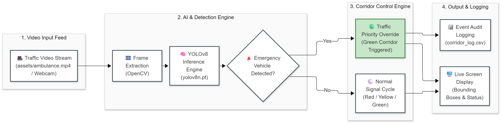

# 🚑 Smart Green-Corridor AI: Autonomous Emergency Vehicle Detection System

An edge-AI computer vision system engineered with **YOLOv8** and **OpenCV** to automate dynamic priority signaling and create uninterrupted "Green Corridors" for emergency response vehicles in real time.

---

## 📌 Problem Statement
Urban emergency vehicles (such as ambulances) face severe delays at traffic intersections, which directly degrades critical golden-hour medical response times. Conventional signaling networks rely on manual police intervention or expensive hardware transponders. This solution enables automated visual prioritization using commodity surveillance video feeds.

---

## 🏗️ System Architecture



### End-to-End Workflow:

1. **Video Ingestion:** Live stream captured from intersection surveillance camera feeds or recorded streams (`assets/ambulance.mp4`).
2. **Frame Pre-Processing & Inference:** OpenCV processes input frames through an optimized Ultralytics YOLOv8 engine (`yolov8n.pt`).
3. **Control & Decision Engine:** Evaluates confidence scores and bounding-box coordinates to immediately trigger an emergency green-corridor state.
4. **Asynchronous Execution:** Delegates audio alarms and CSV event logging to detached threads while rendering a real-time HUD on the live monitor.

---

## 🚀 Key Architectural Features
- **Real-Time Edge Inference:** Leverages YOLOv8 Nano for fast, low-latency object detection on resource-constrained compute platforms.
- **Warm-Up Pipeline:** Integrates inference pre-warming to completely eliminate cold-start latency and frame-dropping during live streams.
- **Asynchronous Event Handling:** Audible alert signaling (`winsound`) and audit trail logging are delegated to background daemon threads to ensure uninterrupted ~30 FPS video processing.
- **Dynamic HUD Feedback:** Live heads-up display rendering active countdown timers, traffic states (RED to GREEN transitions), and detection overlays.
- **Audit Logging:** Automatically captures timestamped incident records into structured CSV files (`corridor_log.csv`) for civic administration and auditing.

---

## 🎬 Live System Demo


---

## 🛠️ Tech Stack
- **Language:** Python 3.x
- **Computer Vision:** OpenCV (`cv2`)
- **Deep Learning Model:** Ultralytics YOLOv8
- **Concurrency:** Multi-threading (`threading`)
- **Data Persistence:** CSV Logger (`corridor_log.csv`)

---

## 📂 Repository Structure

```text
smart-green-corridor/
├── assets/
│   ├── architecture.png    # High-level architecture pipeline
│   └── demo.gif            # Visual output preview & HUD demo
├── .gitignore              # Git ignore rules (protects .env, weights, logs)
├── main.py                 # Core AI detection & control pipeline
├── README.md               # Production-grade documentation
└── requirements.txt        # Frozen dependencies
```
---

## ⚙️ Quick Start

### 1. Clone the Repository:
```
git clone https://github.com/satyanarayana51115/smart-green-corridor.git
cd smart-green-corridor
```
### 2. Set Up Virtual Environment:
```
python -m venv .venv
```
### On Windows:
```
.venv\Scripts\activate
```
### On Linux/macOS:
```
source .venv/bin/activate
```
### 3. Install Dependencies:
```
pip install -r requirements.txt
```
---

## 🚀 Running the Project

### 4. Run the primary application:
```
python main.py
```
* Press q to quit the live feed window.

* All activation events will be saved to 
  corridor_log.csv.

---
